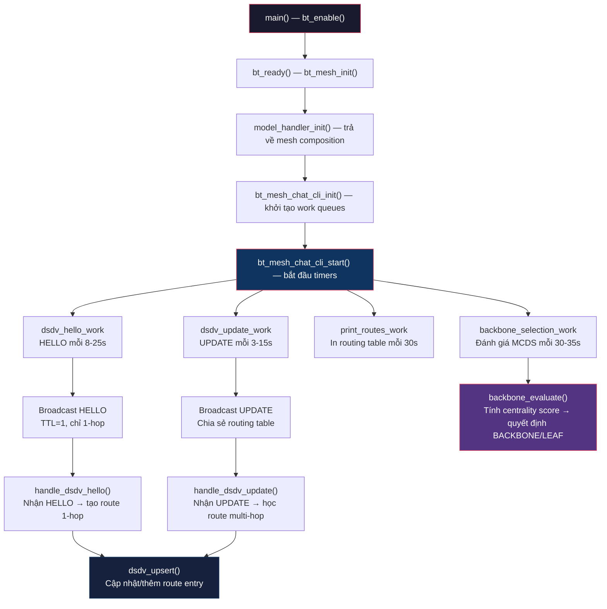
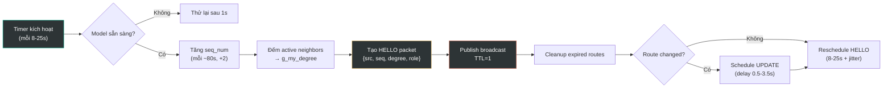
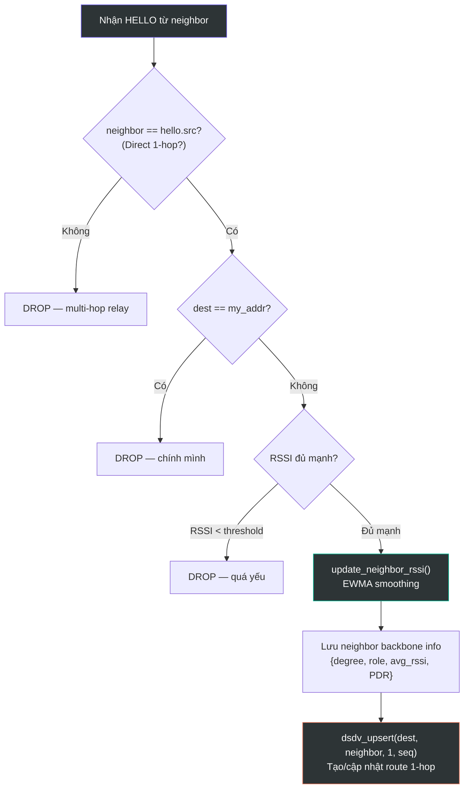
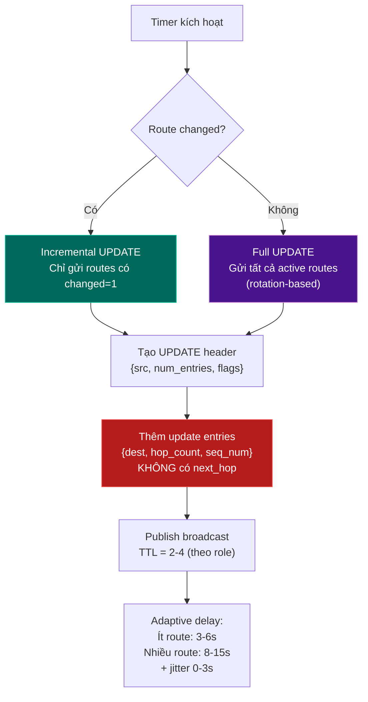
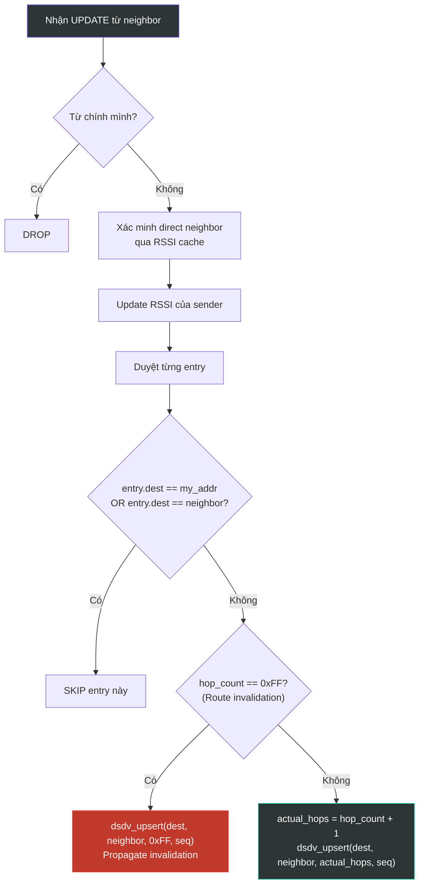
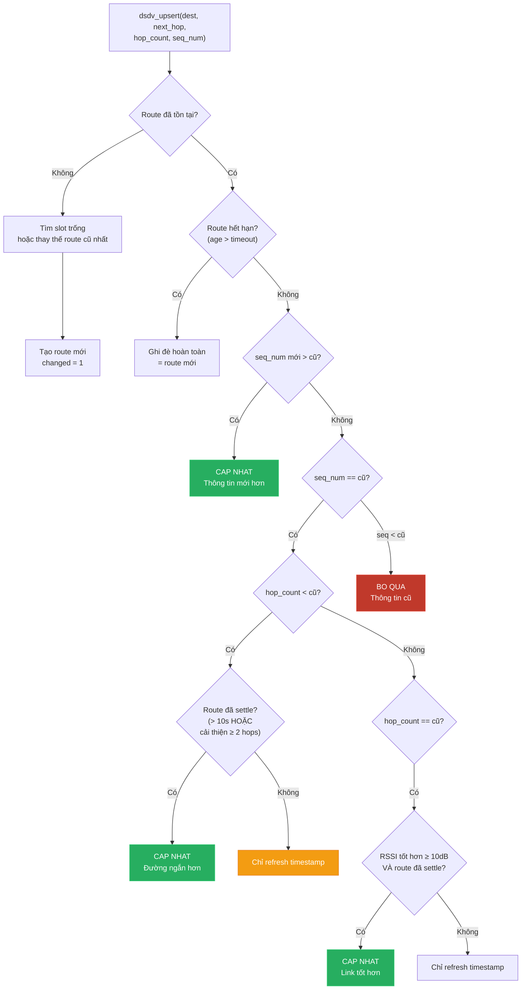
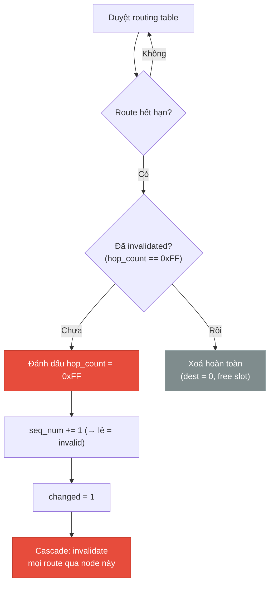
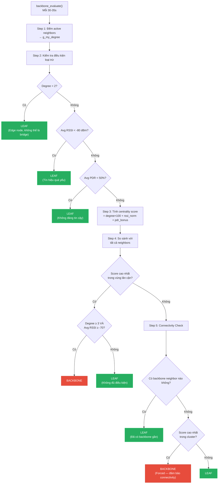
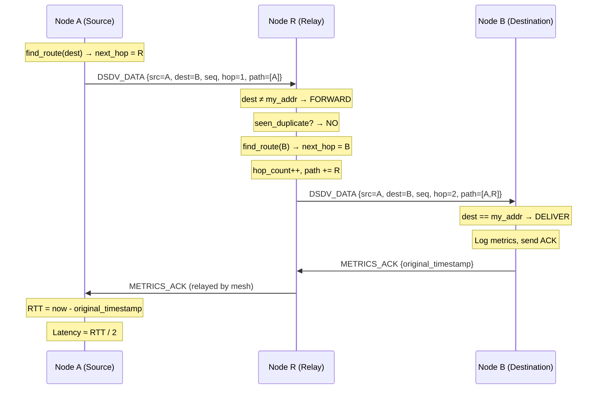
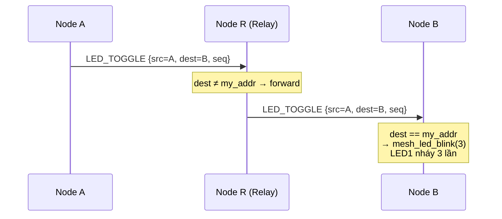

# Phân Tích Code DSDV Routing Protocol

> [!NOTE]
> Tài liệu phân tích chi tiết luồng hoạt động của giao thức DSDV (Destination-Sequenced Distance-Vector) được triển khai trên nền tảng **Nordic nRF Bluetooth Mesh** (Zephyr RTOS), bao gồm cơ chế MCDS Backbone Selection.


## Tổng Quan Luồng Hoạt Động



---

## 1. Khởi Tạo Hệ Thống

### 1.1 `main()` → `bt_ready()` → `bt_mesh_init()`

```c
// main.c
int main(void) {
    bt_enable(bt_ready);  // Bật BLE → callback bt_ready
}

static void bt_ready(int err) {
    dk_leds_init();       // Khởi tạo LEDs
    dk_buttons_init(NULL); // Khởi tạo buttons
    bt_mesh_init(bt_mesh_dk_prov_init(), model_handler_init());
    settings_load();       // Load provisioning data từ NVS
    bt_mesh_prov_enable(BT_MESH_PROV_ADV | BT_MESH_PROV_GATT);
}
```

### 1.2 `bt_mesh_chat_cli_init()` — Khởi Tạo Model

Được gọi tự động bởi Mesh stack sau `bt_mesh_init()`:

```c
static int bt_mesh_chat_cli_init(const struct bt_mesh_model *model) {
    // Khởi tạo 4 delayed work items
    k_work_init_delayable(&dsdv_hello_work, dsdv_send_hello);
    k_work_init_delayable(&dsdv_update_work, dsdv_send_update);
    k_work_init_delayable(&print_routes_work, print_routes_handler);
    k_work_init_delayable(&backbone_selection_work, backbone_selection_handler);
}
```

### 1.3 `bt_mesh_chat_cli_start()` — Khởi Động Timers

Sau khi provisioning hoàn tất:

```c
static int bt_mesh_chat_cli_start(const struct bt_mesh_model *model) {
    // HELLO: 2-7s sau khởi động (random jitter)
    k_work_schedule(&dsdv_hello_work, K_MSEC(2000 + random(5000)));
    // UPDATE: 3-5s sau khởi động
    k_work_schedule(&dsdv_update_work, K_MSEC(3000 + random(2000)));
    // In routing table: 10s sau khởi động
    k_work_schedule(&print_routes_work, K_MSEC(10000));
    // MCDS backbone: 15-20s sau khởi động (chờ thu thập neighbor info)
    k_work_schedule(&backbone_selection_work, K_MSEC(15000 + random(5000)));
}
```

> [!IMPORTANT]
> Mọi timer đều có **random jitter** để tránh tất cả nodes gửi packet cùng lúc (collision avoidance).

---

## 2. Các Loại Packet (Opcode)

| Opcode | Tên | TTL | Mục đích |
|--------|-----|-----|----------|
| `0x12` | **DSDV_HELLO** | 1 (cố định) | Neighbor discovery, RSSI, degree/role broadcast |
| `0x13` | **DSDV_UPDATE** | 2-4 (theo role) | Chia sẻ routing table (incremental hoặc full) |
| `0x14` | **DSDV_DATA** | hop_count+1 | Gửi data end-to-end qua DSDV routing |
| `0x15` | **LED_TOGGLE** | hop_count+1 | Điều khiển LED từ xa |
| `0x0F` | **METRICS_ACK** | via route | ACK cho metrics, tính RTT/latency |

---

## 3. Node Hoạt Động Như Thế Nào

### 3.1 Gửi HELLO — `dsdv_send_hello()`



**Chi tiết quan trọng:**

- **Sequence number**: Chỉ tăng mỗi ~80s (16 lần gửi HELLO × ~5s = ~80s), tăng +2 mỗi lần (giữ số chẵn = valid)
- **Adaptive interval**: `base = 8000 + (route_count × 1000)`, max 15s, cộng jitter random 0-10s
- **HELLO packet** chứa: `src`, `seq_num`, `my_degree` (số neighbor), `my_role` (BACKBONE/LEAF)

### 3.2 Nhận HELLO — `handle_dsdv_hello()`



**Hysteresis RSSI Filtering:**
```
Đã có route → threshold = -80 dBm (dễ giữ)
Chưa có route → threshold = -75 dBm (khó thêm)
→ Tránh route flapping ở biên tín hiệu
```

**PDR (Packet Delivery Ratio) Tracking:**
- Mỗi neighbor có `hello_rx_count` và `pdr_window_start`
- Mỗi HELLO nhận được → tăng count
- Window 60s → reset và đếm lại
- PDR = (received / expected) × 100%

### 3.3 Gửi UPDATE — `dsdv_send_update()`



> [!WARNING]
> **UPDATE entry KHÔNG bao gồm `next_hop`!** Đây là thiết kế quan trọng:
> - Nếu Node A gửi UPDATE chứa `next_hop = B`, thì Node C nhận sẽ set `next_hop = B` — sai!
> - Đúng: Node C nhận UPDATE từ A → set `next_hop = A` (sender)

**Rate Limiting:**
- Tối thiểu 3s giữa 2 UPDATE liên tiếp (`UPDATE_MIN_INTERVAL_MS`)
- Nếu chưa đủ 3s → delay thêm

**Rotation-based Full Update:**
- Dùng `update_rotation_index` để quay vòng qua routing table
- Mỗi lần gửi tối đa 12 entries (`MAX_UPDATE_ENTRIES`)
- Đảm bảo mọi route đều được broadcast sau vài vòng

### 3.4 Nhận UPDATE — `handle_dsdv_update()`



---

## 4. Cập Nhật Routing Table — `dsdv_upsert()`

Đây là **hàm trung tâm** quyết định route nào được chấp nhận:



### Quy Tắc Cập Nhật

| Ưu tiên | Điều kiện | Hành động |
|---------|-----------|-----------|
| 1 | Route hết hạn (expired) | Ghi đè hoàn toàn |
| 2 | `new_seq > old_seq` | Cập nhật ngay (thông tin mới hơn) |
| 3 | `same_seq` + `fewer hops` + settled | Chuyển sang đường ngắn hơn |
| 4 | `same_seq` + `same hops` + RSSI tốt hơn ≥10dB + settled | Chuyển sang link mạnh hơn |
| 5 | `new_seq < old_seq` | **Bỏ qua** hoàn toàn |

### Route Settle Time

> [!TIP]
> **`ROUTE_SETTLE_TIME_MS = 10000` (10s)** — Route phải ổn định ít nhất 10s trước khi được phép chuyển sang đường khác cùng seq_num. Điều này ngăn **route oscillation** khi nhiều đường có cùng chất lượng.

### Sequence Number Convention

```
seq_num chẵn (0, 2, 4, ...) → Route VALID
seq_num lẻ  (1, 3, 5, ...) → Route INVALID (broken)

Khi tạo route mới: seq += 2 (giữ chẵn)
Khi invalidate route: seq += 1 (chuyển sang lẻ)
```

---

## 5. Xử Lý Route Hết Hạn — `dsdv_cleanup_expired_routes()`



**Timeout values:**

| Loại route | Timeout | Lý do |
|------------|---------|-------|
| Direct neighbor (1-hop) | 45s | Nếu miss HELLO 3-4 lần → mất kết nối |
| Multi-hop route | 120s | Cần thời gian hội tụ qua nhiều hop |
| RSSI data | 90s | Giữ RSSI data lâu hơn để ổn định |

**Cascade Invalidation:**
Khi node X bị invalidate → tất cả route có `next_hop == X` cũng bị invalidate (vì không thể đi qua X nữa).

---

## 6. Phân Loại Nút Lá (MCDS Backbone Selection)

### 6.1 Tổng Quan Thuật Toán

Node được phân thành 2 vai trò:
- **BACKBONE**: Relay ON, TTL cao hơn, chuyển tiếp traffic cho cả mạng
- **LEAF**: Relay OFF, TTL thấp, chỉ giao tiếp qua backbone nodes



### 6.2 Công Thức Tính Centrality Score

```
Score = Degree × 100 + RSSI_normalized + PDR_bonus

Trong đó:
  - Degree: Số active neighbors (yếu tố chi phối)
  - RSSI_normalized: map [-100, -30] → [0, 70] điểm
  - PDR_bonus: map [0%, 100%] → [0, 30] điểm

Ví dụ:
  Node A: degree=5, avg_rssi=-55, pdr=90%
  Score = 5×100 + (-55+100) + (90×30/100) = 500 + 45 + 27 = 572

  Node B: degree=3, avg_rssi=-65, pdr=80%
  Score = 3×100 + (-65+100) + (80×30/100) = 300 + 35 + 24 = 359

  → Node A thắng → BACKBONE
```

### 6.3 Điều Kiện Phân Loại

#### Trở Thành LEAF Khi:

| Điều kiện | Ngưỡng | Ý nghĩa |
|-----------|--------|---------|
| Degree quá thấp | `< 2` | Edge node, không có khả năng bridge |
| RSSI quá yếu | `avg < -80 dBm` | Link không đáng tin cậy |
| PDR quá thấp | `< 50%` | Mất quá nhiều packet |
| Không phải score cao nhất | So sánh neighbors | Node khác phù hợp hơn |
| Chưa đủ tiêu chuẩn | `degree < 3` hoặc `avg_rssi < -70` | Không meet minimum backbone requirements |

#### Trở Thành BACKBONE Khi:

| Điều kiện | Chi tiết |
|-----------|----------|
| Score cao nhất trong vùng | Không neighbor nào có score cao hơn |
| Degree ≥ 3 | Ít nhất 3 active neighbors |
| Avg RSSI ≥ -70 dBm | Signal đủ mạnh |
| **HOẶC** Forced backbone | Không có backbone neighbor nào + score cao nhất trong cluster |

#### Tie-Breaker:
```
Khi 2 nodes có cùng score → Node có address nhỏ hơn thắng
```

### 6.4 Tác Động Của Vai Trò

| Thuộc tính | BACKBONE | LEAF |
|------------|----------|------|
| **Relay** | ENABLED | DISABLED |
| **TTL cho UPDATE** | 4 | 2 |
| **TTL cho broadcast** | 3 | 1 |
| **TTL cho HELLO** | 1 (cố định) | 1 (cố định) |
| **TTL cho unicast data** | `hop_count + 1` (giống nhau) | `hop_count + 1` (giống nhau) |

```c
// Áp dụng relay khi role thay đổi:
if (g_my_role == NODE_ROLE_BACKBONE) {
    bt_mesh_cfg_srv_relay_set(BT_MESH_RELAY_ENABLED, ...);
} else {
    bt_mesh_cfg_srv_relay_set(BT_MESH_RELAY_DISABLED, ...);
}
```

---

## 7. Luồng Gửi Data End-to-End

### 7.1 Gửi Data — `bt_mesh_chat_cli_metrics_send()`



### 7.2 Gửi LED Toggle — `bt_mesh_chat_cli_led_toggle_send()`



---

## 8. Cơ Chế Chống Trùng Lặp

### Duplicate Cache — `seen_duplicate()`

```c
struct dsdv_dup_cache {
    uint16_t src;
    uint32_t last_seq;
};
static struct dsdv_dup_cache g_dup_cache[100]; // 100 entries

// Nếu seq <= last_seq → DUPLICATE → return true
// Nếu seq > last_seq → CẬP NHẬT last_seq → return false
```

**Áp dụng cho:** DATA và LED_TOGGLE packets (tránh forward loop)
**KHÔNG áp dụng cho:** HELLO và UPDATE (dùng seq_num comparison trong `dsdv_upsert`)

---

## 9. RSSI Smoothing — EWMA

```c
// Exponentially Weighted Moving Average
// α = 1/32 = 3.125% (new sample weight)
// 96.875% old value + 3.125% new value

int8_t rssi_ewma(int8_t prev, int8_t now) {
    return (31 * prev + now) / 32;
}
```

> [!TIP]
> Smoothing factor rất cao (31/32) → RSSI biến đổi rất chậm → Tránh route flapping do nhiễu tạm thời. Phù hợp cho môi trường BLE Mesh có nhiều nhiễu.

---

## 10. Tổng Kết Timing & Constants

### Timer Intervals

| Timer | Base | Jitter | Min | Max |
|-------|------|--------|-----|-----|
| HELLO | 8-15s (adaptive) | 0-10s | ~8s | ~25s |
| UPDATE (changed) | 3-6s | 0-3s | ~3s | ~9s |
| UPDATE (no change) | 8-15s | 0-3s | ~8s | ~18s |
| Routing table print | 30s | 0 | 30s | 30s |
| Backbone evaluation | 30s | 0-5s | 30s | 35s |

### Timeouts

| Tham số | Giá trị | Mục đích |
|---------|---------|----------|
| `DSDV_NEIGHBOR_TIMEOUT_MS` | 45s | Direct neighbor (1-hop) route expiry |
| `DSDV_ROUTE_TIMEOUT_MS` | 120s | Multi-hop route expiry |
| `NEIGHBOR_RSSI_VALID_WINDOW_MS` | 90s | RSSI data validity window |
| `ROUTE_SETTLE_TIME_MS` | 10s | Minimum route stability before switching |
| `UPDATE_MIN_INTERVAL_MS` | 3s | Rate limit giữa 2 UPDATE |

### Backbone Constants

| Tham số | Giá trị | Mục đích |
|---------|---------|----------|
| `BACKBONE_RSSI_THRESHOLD` | -70 dBm | Min avg RSSI để được BACKBONE |
| `BACKBONE_RSSI_REJECT` | -80 dBm | Dưới ngưỡng → forced LEAF |
| `BACKBONE_MIN_DEGREE` | 3 | Min neighbors để backbone-eligible |
| `BACKBONE_PDR_REJECT` | 50% | PDR dưới 50% → forced LEAF |
| `BACKBONE_EVAL_INTERVAL_MS` | 30s | Re-evaluate interval |

---

## Shell Commands

Các lệnh có thể dùng qua UART shell:

| Lệnh | Mô tả |
|-------|--------|
| `chat status` | In trạng thái provisioning và địa chỉ node |
| `chat routes` | Hiển thị bảng routing DSDV đầy đủ |
| `chat neighbors` | Hiển thị RSSI của các neighbors |
| `chat metrics_to <addr>` | Gửi metrics đến node chỉ định |
| `chat verify_route <addr>` | Xác minh route đến node |
| `chat relay <on/off>` | Bật/tắt relay thủ công |
| `chat led_toggle <addr>` | Nháy LED trên node từ xa |
| `chat backbone` | Hiển thị trạng thái MCDS backbone |

---

## Tóm Tắt Luồng Dữ Liệu Hoàn Chỉnh

````carousel
### Phase 1: Neighbor Discovery
```
[Node A] --HELLO(TTL=1)--> [Node B]
  • B nhận HELLO → tạo route 1-hop đến A
  • B lưu RSSI, degree, role của A
  • B cập nhật PDR tracking cho A
```
<!-- slide -->
### Phase 2: Route Propagation
```
[Node A] --UPDATE--> [Node B] --UPDATE--> [Node C]
  • A share routes: {dest=X, hops=1, seq=10}
  • B nhận → dsdv_upsert(X, A, 2, 10)
  • B share sang C: {dest=X, hops=2, seq=10}
  • C nhận → dsdv_upsert(X, B, 3, 10)
```
<!-- slide -->
### Phase 3: MCDS Backbone Selection
```
Mỗi 30s: backbone_evaluate()
  1. Đếm degree
  2. Filter: RSSI, PDR
  3. Tính centrality score
  4. Greedy: score cao nhất → BACKBONE
  5. Connectivity: forced backbone nếu cluster cô lập
  
BACKBONE → Relay ON, TTL cao
LEAF → Relay OFF, TTL thấp
```
<!-- slide -->
### Phase 4: Data Forwarding
```
[A] --DATA--> [R1] --DATA--> [R2] --DATA--> [B]
  • Lookup routing table tại mỗi hop
  • hop_count++ tại mỗi relay
  • Path tracking: path_nodes[] lưu đường đi
  • Duplicate detection: seen_duplicate()
  • ACK từ B → tính RTT/latency
```
````
